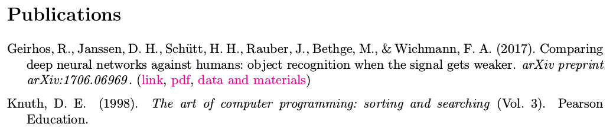
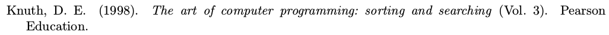

# academic-cv-publications

Generate a customised list of publications for your LaTeX cv using Bibtex entries.

## Description
It is common to include a list of publications in one's academic cv. While generating a list of references from a .bib file is standard practice for writing a paper, I was surprised to see that most LaTeX academic cv templates found online rely on the user manually typing the references in a list. Clearly, this is undesirable, as one usually already has a list Bibtex entries for one's publications, and changing the citation style means changing every single entry. Still, this has the advantage that publications can be easily sorted as desired, split into different subsections (peer-reviewed articles, conference abstracts, ...) and enriched with links to the pdf.

I here show a way how a list of publications can be easily generated from a ``.bib`` file with all the advantages listed above (customised order, splitting into sections, links) AND little effort (no more than citing a paper).

I hope you may find this useful for your own LaTeX cv!



## In detail

**Desired outcome:**



**The cumbersome way:**
```
\hangpara{1.5em}{1}Knuth, D. E. (1998). 
\textit{The art of computer programming: sorting and searching} (Vol. 3). Pearson Education.
```

**New:**
```
\publication{Knuth1998}
```
## A note on compilation order

You need to generate a ``.bbl`` file from the ``.bib`` file prior to compiling the pdf.
